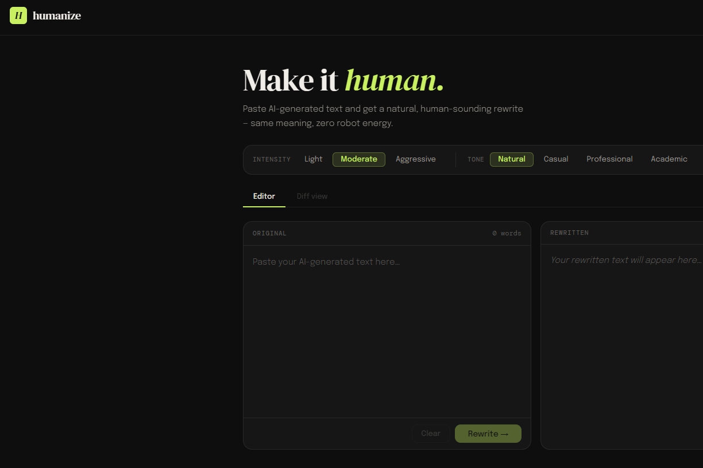

# 🟢 Humanize — Make It Human.

> Paste AI-generated text and get a natural, human-sounding rewrite — same meaning, zero robot energy.



🔗 **Live Demo:** [https://your-deployed-link.onrender.com](https://plag-reducer.onrender.com)

---

## ✨ Features

- **AI-Powered Rewriting** — Uses OpenAI GPT to rewrite AI-generated text into natural, human-sounding prose
- **Intensity Levels** — Choose between `Light`, `Moderate`, and `Aggressive` rewriting intensity
- **Tone Selection** — Pick from `Natural`, `Casual`, `Professional`, or `Academic` tones
- **Diff View** — Side-by-side comparison of original vs rewritten text with change highlighting
- **Word Counter** — Live word count on your input text
- **One-Click Clear** — Instantly reset the editor

---

## 🛠 Tech Stack

| Layer | Technology |
|-------|-----------|
| Frontend | React (Vite) |
| Backend | Node.js + Express |
| AI | OpenAI API (GPT-4o) |

---

## 📁 Project Structure

```
humanize/
├── client/                     # React frontend
│   ├── src/
│   │   ├── components/
│   │   │   ├── Editor.jsx
│   │   │   ├── DiffView.jsx
│   │   │   ├── IntensitySelector.jsx
│   │   │   └── ToneSelector.jsx
│   │   ├── App.jsx
│   │   └── main.jsx
│   └── package.json
│
├── server/                     # Express backend
│   ├── routes/
│   │   └── rewrite.js
│   ├── middleware/
│   │   └── rateLimit.js
│   ├── index.js
│   └── package.json
│
└── README.md
```

---

## ⚙️ Intensity & Tone Guide

### Intensity

| Level | Description |
|-------|-------------|
| `Light` | Minor rewording — keeps most of the original structure |
| `Moderate` | Balanced rewrite — natural flow with clear changes |
| `Aggressive` | Heavy rewrite — maximum humanisation, significant restructuring |

### Tone

| Tone | Best For |
|------|----------|
| `Natural` | General use — balanced and conversational |
| `Casual` | Blog posts, social media, informal writing |
| `Professional` | Emails, business documents, reports |
| `Academic` | Essays, research papers, formal analysis |

---

## 📄 License

MIT License — feel free to use, modify, and distribute.

---

## 🙌 Acknowledgements

- [OpenAI](https://openai.com) for the GPT API
- [React](https://react.dev) and [Vite](https://vitejs.dev) for the frontend
- [Express](https://expressjs.com) for the backend server
